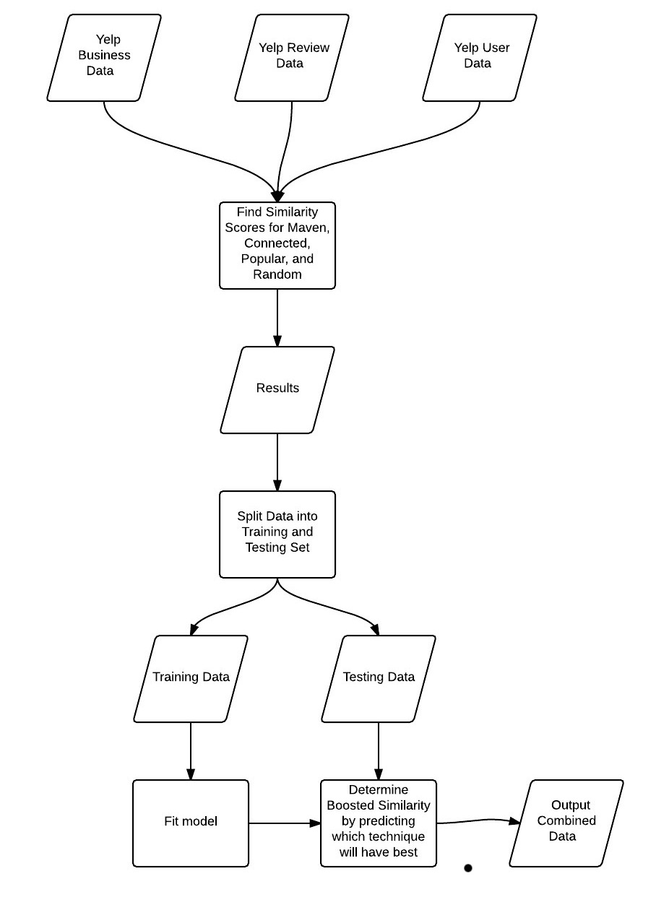

```{r, echo=FALSE, message=FALSE, warning=FALSE}
library("ggplot2")
library(grid)
library(gridExtra)
library(jsonlite)
library(tm)
library(openNLP)
library(caret)

training <- read.csv("training.csv", stringsAsFactors=FALSE)
combined <- read.csv("combined.csv", stringsAsFactors=FALSE)
```

# Title
Predicting Strengths and Weaknesses of a Business using Yelp Data

## Introduction
This report focuses on using samples of of review data from the Yelp Dataset Challenge data set to efficiently predict the strengths and weaknesses of a business. Text mining encompasses a vast field of theoretical approaches and methods with one thing in
common: text as input information [1]. The tm package in R provides a framework that allows text mining and natural language processing techniques to be applied to datasets in a convenient way. We will leverage the tm package to analyze review data from the Yelp Dataset Challenge data set to determine the part of speech of each word in a review and determine the most frequently used nouns associated with positive reviews of a business (defined as strengths) and negative reviews of a business (defined as weaknesses). 

### Glosary of Terms
| __Term__  | __Definition__  |
| -------------- | ----- |
| tm   | A text mining package for R that supports natural language processing of texts |
| NLP   | Natural Language Processing |
| Favorable Review   | A review with a rating of 3.5 or above |
| Unfavorable Review   | A review with a rating of 2.5 or below |
| Similarity Score   | The number of words in the top 25 strengths or weaknesses in the sampled data that are also present in the full data  |
| Stopword   | A commonly used word that is filtered out before processing review text |
| Strength   | A high frequency noun in the favorable reviews of a business that is not a stopword |
| Weakness   | A high frequency noun in the unfavorable reviews of a business that is not a stopword |
| Popular   | A user that reviews a business that has many friends |
| Connected   | A user that reviews a business that also has many friends that reviewed the same business |
| Maven   | A user that reviewed a business that also has many friends that reviewed the same business AND those friends gave that business the exact same star rating |
| Boosted   | An attempt was made to boost the similarity scores by predicting which sampling technique was best for the given business. |
| Random   | Randomly selected reviews about a business used as a baseline |

So, why not just crunch all of the data (or a high percentage of it) to determine the strengths and weaknesses? Why try to predict or sample at all? As wonderful as the tm package is, it is very slow. Examining a large number of reviews to find the strengths of a business can take a very long time. A sample size of up to 500 reviews was used in this analysis to determine the true strengths and weaknesses and processing it could take up to an hour. The goal here is to determine a sampling technique tha can perform better than random so that you can pick a smaller number of samples (75 was used) to make a reasonably accurate prediction. The top 25 strengths and weaknesses idetified from the full data were then compared against the top 25 strengths and weaknesses identified by the sampled data to determine the similarity.

| __Scenario__  | __Size__| __Time (in s)__  |
| -------------- | ----- | ----- |
| Strengths - Full   | 500 | `r summaryRprof("good_full.prof")$sampling.time` |
| Strengths - Sample   | 75 | `r summaryRprof("good_sample.prof")$sampling.time` |

## Methods and Data
### Examined Sampling Techniques 
A **Maven** is a trusted expert in a particular field, who seeks to pass knowledge on to others. The word maven comes from Hebrew, meaning "one who understands", based on an accumulation of knowledge. I was introduced to the concept of a maven through Malcolm Gladwell's book "The Tipping Point". To find the mavens in this data we examined the friends of a user that reviewed a business to see if they gave the business the exact same star rating. The potential maven user got a point for each friend that gave the same rating. The mavens were then sorted and the top 75 reviews were used for sampling.

A **Connected** user is similar to a maven, but they are scored only on the number of friends that also reviewed the same business with no weight given to the star rating. The connected users were sorted by number of connections and the top 75 reviews were used for sampling.

A **Popular** user is one who reviewed a business that has a large number of friends. The friends may or may not have also reviewed the business. The popular users were sorted by number of friends and the top 75 reviews were used for sampling.

A **Boosted** sample tries to predict the technique that will yield the best results using machine learning techniques and apply the best one to the business.

For control purposes, a **Random** sample of 75 reviews of the business taken was also used as a baseline.

### Use of tm Package for Part of Speech Tagging
Strengths and weaknesses are extracted from the review text in the following manner:

* All of the review texts are concatenated and collapsed into a single text
* All characters are converted to lower case
* Common english stop words are removed
* The category of the business is removed to keep it from showing up as a strength or weakness (ie; reviews of a Taco joint will mention Taco a lot)
* Each word is tagged with a part of speech
* All non-nouns are removed
* The word list is sorted in descending order by frequency

The result looks like this graphically.

```{r, echo=FALSE,fig.height=4, fig.width=4, message=FALSE, warning=FALSE, output=FALSE}
number_raw_reviews <- 10

business <- stream_in(file("my_business.json"), verbose=FALSE)
reviews <- stream_in(file("my_reviews.json"), verbose=FALSE)

extractPOS <- function(x, thisPOSregex) {
    x <- as.String(x)
    wordAnnotation <- annotate(x, list(Maxent_Sent_Token_Annotator(), Maxent_Word_Token_Annotator()))
    POSAnnotation <- annotate(x, Maxent_POS_Tag_Annotator(), wordAnnotation)
    POSwords <- subset(POSAnnotation, type == "word")
    tags <- sapply(POSwords$features, '[[', "POS")
    thisPOSindex <- grep(thisPOSregex, tags)
    tokenizedAndTagged <- sprintf("%s/%s", x[POSwords][thisPOSindex], tags[thisPOSindex])
    untokenizedAndTagged <- paste(tokenizedAndTagged, collapse = " ")
    untokenizedAndTagged
}
good <- function(target_reviews, target_business) {
    my_reviews <- target_reviews[target_reviews$stars > 3, ]
    ssize <- ifelse(dim(my_reviews)[1]>=number_raw_reviews, number_raw_reviews, dim(my_reviews)[1])
    review_sample <- my_reviews[sample(nrow(my_reviews), ssize), ]
    review_text <- paste(review_sample$text, collapse=" ")
    nouns_review_text <- gsub("/NN", "", extractPOS(review_text, ".*NN$"))
    review_source <- VectorSource(nouns_review_text)
    corpus <- Corpus(review_source)
    corpus <- tm_map(corpus, content_transformer(tolower))
    corpus <- tm_map(corpus, removePunctuation)
    my_stopwords <- unlist(strsplit(tolower(paste(unlist(lapply(target_business$categories,  function (x) gsub("(.*)s$", "\\1", x))), collapse=" ")), " "))
    
    corpus <- tm_map(corpus, removeWords, c(stopwords("english"), "place", "spot", "way", my_stopwords))
    dtm <- DocumentTermMatrix(corpus)
    dtm2 <- as.matrix(dtm)
    frequency <- colSums(dtm2)
    frequency <- sort(frequency, decreasing=TRUE)
    frequency
}

good <- good(reviews, business)

wf <- data.frame(word=names(good), freq=good)   
p <- ggplot(subset(wf, freq>1), aes(word, freq, fill=word))    
p <- p + geom_bar(stat="identity")   
p <- p + theme(axis.text.x=element_text(angle=45, hjust=1))  
p
```

### Similarity Scores
The similarity of a full run and an sampled run was determined very simply by determining how many nouns from the top 25 of the sampled text are in the top 25 words of the full text.

```{r, echo=TRUE}
similarity <- function(x, y) {
    count <- 0
    names_x <- names(x)
    count <- sum(sapply(names(y), function(z) ifelse(z %in% names_x, 1, 0)))
    100 * (count / length(y))
}
````

### Basic Processing
The following procedure was used to test how well a sampling method performed. Random sampling is the control group. 




### Modeling for Boosted Sampling
Boosted sampling is performed due to a strange anamoly in the data where certain sampling techniques work well on certain data but perform only as well or below random sampling as a whole.

| __Technique__  | __Rating__| __Mean__  |
| -------------- | ----- | ----- |
| Maven - Strength   | >= 3.5 | `r mean(training$good.maven[training$rating >= 3.5])` |
| Conn - Strength   | >= 3.5 | `r mean(training$good.conn[training$rating >= 3.5])` |
| Pop - Strength   | >= 3.5 | `r mean(training$good.pop[training$rating >= 3.5])` |
| Random - Strength   | >= 3.5 | `r mean(training$good.random[training$rating >= 3.5])` |
| Maven - Strength   | All | `r mean(training$good.maven)` |
| Conn - Strength   | All | `r mean(training$good.conn)` |
| Pop - Strength   | All | `r mean(training$good.pop)` |
| Random - Strength   | All | `r mean(training$good.random)` |
| Maven - Strength   | <= 3.0 | `r mean(training$good.maven[training$rating <= 3.0])` |
| Conn - Strength   | <= 3.0 | `r mean(training$good.conn[training$rating <= 3.0])` |
| Pop - Strength   | <= 3.0 | `r mean(training$good.pop[training$rating <= 3.0])` |
| Random - Strength   | <= 3.0 | `r mean(training$good.random[training$rating <= 3.0])` |


As you can see the maven technique performs much better than random when the overall when the rating is over 3.5, but not any better overall, and worse when the start rating is less than 3.0. The following is an example of how the modeling was done using the RandomForest method.


```{r}
create_models <- function() {    
    trc <- trainControl(method="cv",number=5)
    training <- read.csv("training.csv", stringsAsFactors=FALSE)
    good.mavenFit <- train(good.maven ~ rating + review.count + 
                                        good.review.count + 
                                        good.maven.count + 
                                        good.conn.count,
                           data=training,method="rf",
                           trc,
                           prox=TRUE,allowParallel=TRUE)
    

    
    bad.mavenFit <- train(bad.maven ~ rating + review.count + 
                                      bad.review.count + 
                                      bad.maven.count + 
                                      bad.conn.count,
                          data=training,method="rf",
                          trc,
                          prox=TRUE,allowParallel=TRUE)
    
    # Models are also trained for Connected, Popular, and Random 
    # Sampling as well but not shown here.
}
```

## Results
Dissappointingly, the results show that no sampling techniques performs significantly better than random sampling over a representative mix of businesses. This is in spite of the fact that both the Maven and Connectected techniques perform significantly better on businesses that were rated at 3.5 or above.

| __Technique__  | __Scenario__| __Mean__  |
| -------------- | ----- | ----- |
| Boosted   | Strength | `r mean(combined$good.boost)` |
| Maven    | Strength | `r mean(combined$good.maven)` |
| Conn    | Strength | `r mean(combined$good.conn)` |
| Pop   | Strength | `r mean(combined$good.pop)` |
| Random   | Strength | `r mean(combined$good.random)` |
| Boosted   | Weakness | `r mean(combined$bad.boost)` |
| Maven    | Weakness | `r mean(combined$bad.maven)` |
| Conn    | Weakness | `r mean(combined$bad.conn)` |
| Pop   | Weakness | `r mean(combined$bad.pop)` |
| Random   | Weakness | `r mean(combined$bad.random)` |


The Boosted technique definitely shows promise and I think it could be tuned to outperform random sampling by a higher margin for strengths. The weaknesses are more variable, but even there boosting shows proise.


```{r, echo=FALSE,fig.height=6, fig.width=6}
df <- read.csv("combined.csv", stringsAsFactors=FALSE)

p1 <- ggplot(df, aes(name, x=id)) + 
    scale_colour_manual("", breaks=c("Boost", "Maven", "Conn", "Pop", "Random"), values=c('blue', 'orange', 'green', 'red', 'yellow')) +
    geom_line(aes(y = good.boost, colour="Boost")) + 
    geom_line(aes(y = good.maven, colour="Maven")) +
    geom_line(aes(y = good.conn, colour="Conn")) +
    geom_line(aes(y = good.pop, colour="Pop")) +
    geom_line(aes(y = good.random, colour="Random")) +
    ylab("Similarity") +
    xlab("") +
    ggtitle("Strengths")

types <- c("Boost", "Maven", "Conn", "Pop", "Random")
values <- c(mean(df$good.boost), mean(df$good.maven), mean(df$good.conn), mean(df$good.pop), mean(df$good.random))
mydf <- data.frame(types, values)
names(mydf) <- c("Type", "Value")

p2 <- ggplot(mydf, aes(x=factor(Type), y=Value, fill=Type)) +
    geom_bar(stat = "identity") +
    geom_hline(aes(yintercept=mean(df$good.random), colour="purple")) +
    ylab("Similarity") +
    xlab("") +
    ggtitle("Strengths")

p3 <- ggplot(df, aes(name, x=id)) + 
    scale_colour_manual("", breaks=c("Boost", "Maven", "Conn", "Pop", "Random"), values=c('blue', 'orange', 'green', 'red', 'yellow')) +
    geom_line(aes(y = bad.boost, colour="Boost")) + 
    geom_line(aes(y = bad.maven, colour="Maven")) +
    geom_line(aes(y = bad.conn, colour="Conn")) +
    geom_line(aes(y = bad.pop, colour="Pop")) +
    geom_line(aes(y = bad.random, colour="Random")) +
    ylab("Similarity") +
    xlab("") +
    ggtitle("Weakness")

types <- c("Boost", "Random", "Maven", "Conn", "Pop")
values <- c(mean(df$bad.boost), mean(df$bad.random), mean(df$bad.maven), mean(df$bad.conn), mean(df$bad.pop))
mydf <- data.frame(types, values)
names(mydf) <- c("Type", "Value")

p4 <- ggplot(mydf, aes(x=factor(Type), y=Value, fill=Type)) +
    geom_bar(stat = "identity") +
    geom_hline(aes(yintercept=mean(df$bad.random), colour="purple")) +
    ylab("Similarity") +
    xlab("") +
    ggtitle("Weakness")


grid.arrange(p1, p2, p3, p4, ncol=2)
```

## Discussion
If I had to do this project over again, I would batch process the full data set with something like Hadoop to determine the top strengths and weaknesses of each business. R did not perform well performance wise on the computationally expensive data mining tasks. I had to run a task almost two days just to get the results for 50 businesses. This left ar less time to explore and tune the different sampling techniques. The results were mixed due to this even though the Maven and Connectected techniques showed great promise on certain subsets of the data. The Boosted approach could also be tuned slightly better with more runs and more features so that it could better predict which technique to use. Even though the results were not what I expected, the challenge of working on the data set was fun and I can definitely use the experince on future projects. 
