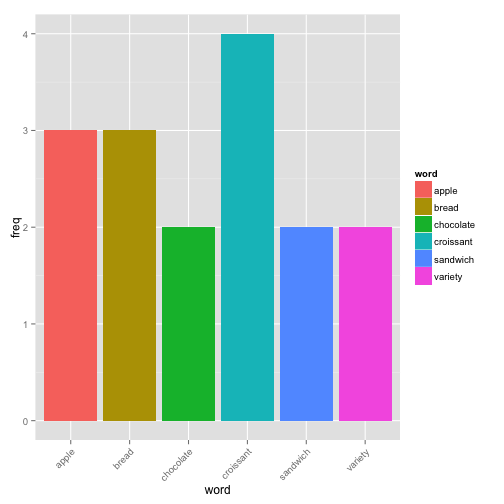
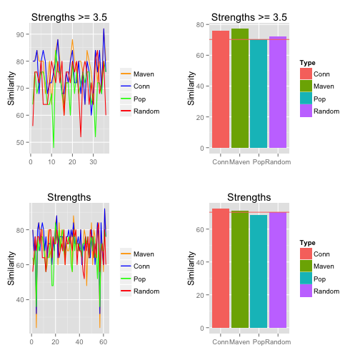
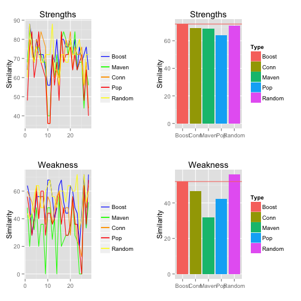

Predicting Strengths and Weaknesses of a Business using Yelp Data
========================================================
author: Stephen Dimig
date: Sat Nov 14 21:38:17 2015

Introduction
========================================================
This report examines sampling techniques on review data from the Yelp Dataset Challenge data set to efficiently predict the strengths and weaknesses of a business. Prediction is needed due to heavy computational cost of text mining. 

**Favorable Review** A review with a rating of 3.5 or above

**Unfavorable Review** A review with a rating of 2.5 or below

**Similarity Score** The number of words in the top 25 of the sampled data that are also present in the full data

**Strength** A high frequency noun in the favorable reviews of a business

**Weakness** A high frequency noun in the unfavorable reviews of a business

Sampling Techniques
========================================================
**Maven** is a influential and trusted expert in a particular field. Mavens have lots of friends that all gave a business the exact same star rating.

**Connected** is similar to a maven, but they are scored only on the number of friends that also reviewed the same business.

**Popular** is a user who reviewed a business that has many friends.

**Boosted** tries to predict a sampling technique that will yield the best results using machine learning techniques and apply the best technique to that business.

**Random** is a randomly chosen sample of 75 reviews.

Part of Speech Tagging with TM
========================================================
The R Text Mining Package with Natural Language Processing was used to tag parts of speech in a review to determine strengths and weaknesses.

 

Boosting
========================================================
Initial data runs showed that techniques such as Maven and Connected were clearly better on subsets of the data. Boosting attempts to predict the best technique using machine learning.

 

Results
========================================================
Results showed that only the Boosting technique beat random sampling for strengths and random sampling was actually best for weaknesses. More work could be done with the prediction model to improve Boosting.

 

